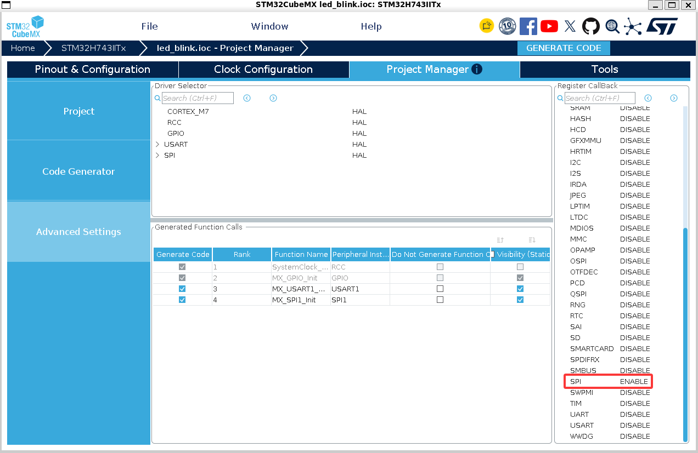

# lcdriv

裸机 LCD 驱动库：C++17 受限子集实现，header-only。只做单帧传输（`init` / `pushFrame` / `fillScreen` / `readID` / `setOrientation`），不带字体、不带 GFX。

## 特性

- **干净的驱动**：只做核心接口；帧缓冲由上层预分配，驱动不持有、不复制。
- **解耦设计**：传输（Bus）与控制器（Controller）正交——换总线只写 Bus，换屏只写 Controller。
- **编译期确定**：总线、控制器、分辨率（M/N）、屏数（P）、传输口味（dma）全部是模板参数，零运行时开销。
- **零开销红线**：无堆、无异常、无 RTTI、无虚表、无动态静态初始化。
- **传输口味**：`dma=false` 阻塞 / `dma=true` 异步 DMA（链式分块 + 完成回调释放 CS）。
- **多屏**：同一 Driver 管理同一条 SPI 上同 controller 的 `P` 块屏（`panel` 索引 + CS 区分）。

## 前置约束

1. **C++17**（用到 `std::optional`、`if constexpr`、`static inline`）。
2. **STM32 HAL + include 顺序契约**：库不 include 任何 HAL/家族头（不锁死系列）。使用 lcdriv 的每个 TU 先让 HAL 可见，再 include 伞头：
   ```cpp
   #include "main.h"       // 工程头（STM32 HAL 类型来源；家族由工程决定）
   #include "lcdriv.hpp"   // 库伞头
   ```
3. **`dma=true` 需开启 HAL 回调注册**：在 CubeMX 里 `Project Manager → Advanced Settings → SPI → Register Callback = Enable`（等价于 `stm32xxx_hal_conf.h` 中 `USE_HAL_SPI_REGISTER_CALLBACKS 1U`）。不开则只能走弱回调，会破坏 header-only。

4. **`dma=true` 帧缓冲内存**：帧缓冲须放 **DMA 可达内存**（如 AXI SRAM `0x24000000`，**不能放 DTCM**），并保证 **D-Cache 一致性**（关 D-Cache / MPU 设 non-cacheable / 传输前 `SCB_CleanDCache`）。
5. **字节序**：RGB565 像素**高字节在前**（`0xF800` → `0xF8 0x00`）；帧缓冲用字节数组、高字节在前，直接 DMA 不错序。
6. 固件侧建议按红线编译：`-fno-exceptions -fno-rtti -fno-threadsafe-statics`（库自身由 `tests/RestrictedCompile.cpp` 门禁保证）。
7. **无错误路径**：库假定 HAL 成功；接线/型号自检靠 `readID` 由调用方比对。

## 快速开始

```cpp
#include "main.h"
#include "lcdriv.hpp"

// GpioPin = 库级公共引脚类型（端口 + 引脚）
GpioPin dc{GPIOB, GPIO_PIN_0};               // 命令/数据（低=命令，归 Controller）
GpioPin cs[1] = {{GPIOB, GPIO_PIN_4}};       // 片选（低有效，归 PanelMgr）
GpioPin rst[1] = {{GPIOB, GPIO_PIN_1}};      // 复位（低有效，归 PanelMgr）

// 模板参数：<总线, 控制器, 宽 M, 高 N, 屏数 P=1, dma=false>
using Lcd = LcdDriver<BusType::SPI, ControllerType::ILI9341, 320, 240>;

// 方式一：默认构造 + init（传统 C 式）
Lcd lcd;
lcd.init(&hspi1, dc, cs, rst);

// 方式二（推荐）：原子构造（构造 = 装配 + 上电，无"未初始化"中间态）
std::optional<Lcd> lcd2;
lcd2.emplace(&hspi1, dc, cs, rst);

// 推一帧（M*N*2 字节；panel = 屏索引，P=1 时恒 0）
static uint8_t px[320 * 240 * 2];   // 帧缓冲由上层预分配；RGB565 高字节在前
lcd.pushFrame(0, px);
```

`pushFrame` 返回 `bool`（**缓冲交接契约**）：`true` = 已上屏（缓冲交给传输，换另一块渲染）；`false` = 未上屏（忙，缓冲仍归调用方，可继续用）。典型 latest-wins 双缓冲：

```cpp
if (lcd.pushFrame(0, curBuf)) {
    curBuf = otherBuf;   // 上屏成功 → 换缓冲
}
// else：丢帧，继续用 curBuf 渲染下一帧
```

其余门面：`fillScreen(panel, color)`、`readID(panel)`、`setOrientation(panel, madctl)`、`width()` / `height()`。`dma=true` 只需把模板末参设为 `true`。

## 架构简介

三层正交 + 一个跨层组件，全部编译期绑定：

```
LcdDriver<BusType, ControllerType, M, N, P, dma>   组合根 + 门面
   ├── Bus<BusType, P, dma>             字节管道：send / sendBulk / read（不感知命令/分辨率；完成点释放 CS）
   ├── Controller<ControllerType, M, N> 设备协议 + DC（duck-type 调 Bus）
   └── PanelMgr<P>                      屏组 GPIO：每屏 {CS, RST} + 互斥（跨层组件）
```

- **换总线** = 写一个 Bus 特化；**换屏** = 写一个 Controller 偏特化；**换分辨率 / 屏数 / 口味** = 只改模板参数，零新代码。
- 多屏：同一条 SPI 上同 controller 的多块屏放进**一个 Driver**（`P` + `panel` 区分）；不同总线 = 各自 Driver。

详细设计见 [doc/](doc/README.md)（spec，实现与维护的唯一依据）：[代码架构](doc/code/architecture.md) → 各层算法 spec；关键取舍见 [ADR](doc/adr/0001-dma-completion-routing.md)。

## 支持矩阵

| | SPI | I2C |
|---|---|---|
| **ILI9341** | ✅ 当前（RGB565；竖屏 240×320 已实测，横屏 320×240 MADCTL 待实测锁定） | 待加 |
| **ST7789** | 待加 | — |

## 集成（消费方如何引入）

lcdriv 是 **header-only 模板库**：引入 = 让 `include/` 目录可见（不编译、不链接、无库产物）。

**方式 1（推荐，CMake FetchContent，版本可钉）**：

```cmake
# lcdriv 侧提供 INTERFACE 目标（仓库根 CMakeLists.txt）：
#   add_library(lcdriv INTERFACE)
#   add_library(lcdriv::lcdriv ALIAS lcdriv)
#   target_include_directories(lcdriv INTERFACE include/)

# 消费方 CMakeLists.txt：
include(FetchContent)
FetchContent_Declare(lcdriv
    GIT_REPOSITORY https://github.com/yun-qilong/lcdriv.git
    GIT_TAG        main   # 发布后钉到发布分支/标签
)
FetchContent_MakeAvailable(lcdriv)
target_link_libraries(<固件目标> lcdriv)   # INTERFACE 目标只传播 include 目录与用法要求
```

**方式 2（最小，裸 include path）**：把 `lcdriv/include` 加进消费方 include 路径即可（联调最快，但路径写死、不锁版本）。

## 构建与测试

```bash
cmake -S . -B build
cmake --build build -j
ctest --test-dir build --output-on-failure
```

- gtest v1.17.0 经 FetchContent 拉取；离线/内网可用 `-DFETCHCONTENT_SOURCE_DIR_GOOGLETEST=<本地 googletest 源码>` 覆盖。
- 分层 UT + MT，测试经 `tests/support/hal_stub`（主机侧 HAL 替身）在**不改库代码**的前提下编译运行真实库逻辑；`lcdriv_restricted` 为红线编译门禁。测试框架规范见 [doc/test/architecture.md](doc/test/architecture.md)。

## 版本与分支策略

- 主分支持续演进；**实现并硬件调试完成后，将当前实现版本单独拉发布分支**（脱离主干，仅 bugfix 演进）。
- 消费方以发布分支/标签作为依赖版本（`GIT_TAG` 指向发布分支/标签）。
- 协议相关数据（初始化序列、MADCTL 实测值）变更须硬件重新实测，并同步 Controller spec 与对应测试。

## 文档导航

- [doc/README.md](doc/README.md) —— spec 索引与阅读顺序
- [doc/code/architecture.md](doc/code/architecture.md) —— 代码架构（分层/模板策略/接口契约）
- [doc/code/](doc/code/) —— 各层算法 spec（bus / controller / driver / panelMgr）
- [doc/adr/](doc/adr/) —— 架构决策记录（ADR）

> 实现与维护以 `doc/` 为准；代码中不写注释，需要解释的内容一律见 doc/。
